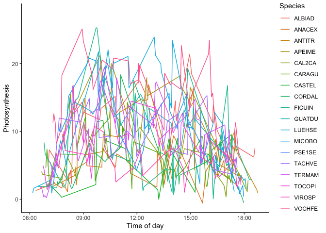
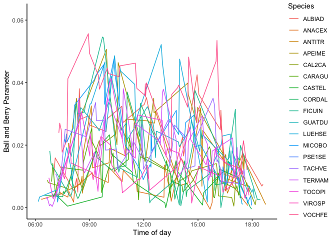
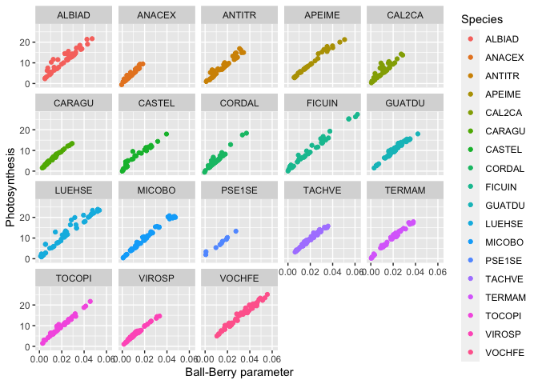
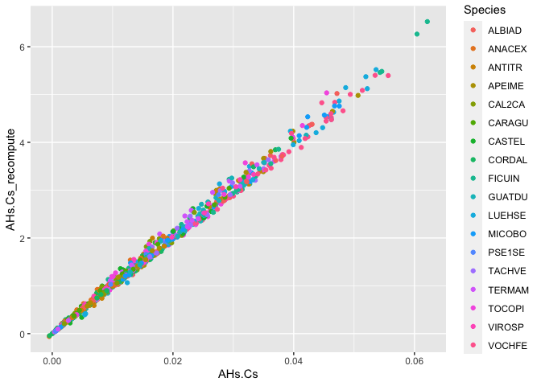
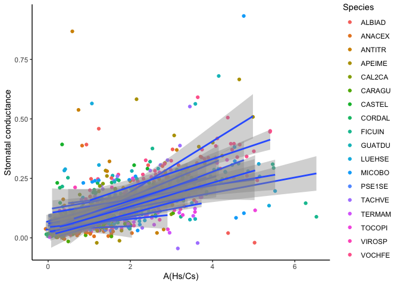

Collecting_Input_Data_for_SCOPE-Panama
================
Kelvin Acebron
2022-06-30

*This document provides systematic gathering of available data from
NGEE-Tropics and FLUXNET from Panama sites as input values for the SCOPE
model.*

### Section 1. Getting estimate of Ball-Berry parameters from NGEE-Tropics dataset (NGT0039)

1.  Read downloaded dataset from NGEE-Tropics. The data came from:
    NGT0039 Diurnal leaf gas exchange survey, Feb2016-May2016, PA-SLZ,
    PA-PNM: Panama

``` r
library("readxl")
ENSO_Panama_DiurnalGasEx <- read_excel("/Users/kelvinacebron/Documents/SERC NASA ROSES grant /03 Data/NGEE - T Panama Dataset/NGT0039_2016_Panama_DiurnalGasEx_v2_20220506205826/2016ENSO_Panama_DiurnalGasEx_v2.xlsx", sheet = "2016ENSO_diurnal")
```

``` r
variable_description <- read_excel("/Users/kelvinacebron/Documents/SERC NASA ROSES grant /03 Data/NGEE - T Panama Dataset/NGT0039_2016_Panama_DiurnalGasEx_v2_20220506205826/2016ENSO_Panama_DiurnalGasEx_v2.xlsx", sheet = "DCD")
```

    ## New names:
    ## • `` -> `...3`

``` r
print(variable_description)
```

    ## # A tibble: 67 × 3
    ##    Number_Header_Rows    `1`                                         ...3       
    ##    <chr>                 <chr>                                       <chr>      
    ##  1 ColumnName_Row_Number 1                                           <NA>       
    ##  2 Column_Delimiter      na                                          <NA>       
    ##  3 Datafile_ColumnName   Datafile_Measure                            Datafile_U…
    ##  4 YYYYMMDD              Measurement date                            numeric    
    ##  5 HHMMSS                Measurement local time                      numeric    
    ##  6 machine_name          Licor 6400XT instrument name                text       
    ##  7 serial                Licor 6400XT instrument serial number       alphanumer…
    ##  8 Location              Canopy crane location                       text       
    ##  9 Time Point            Relative time of measurement throughout day integer    
    ## 10 Species               STRI species code                           alphanumer…
    ## # … with 57 more rows

2.  Changing time from character format to timestamp

``` r
ENSO_Panama_DiurnalGasEx$datetime <- as.POSIXlt(strptime(paste(ENSO_Panama_DiurnalGasEx$YYYYMMDD, " ", ENSO_Panama_DiurnalGasEx$HHMMSS), "%Y%m%d %H:%M:%S"))
```

3.  Removing non-alphanumeric characters from the column names
    (Important in succeeding operations)

``` r
names(ENSO_Panama_DiurnalGasEx) <- gsub(x = names(ENSO_Panama_DiurnalGasEx), pattern = "/", replacement = '.')
print(ENSO_Panama_DiurnalGasEx)
```

    ## # A tibble: 781 × 65
    ##    YYYYMMDD HHMMSS   machine_name serial   Location `Time Point` Species
    ##       <dbl> <chr>    <chr>        <chr>    <chr>    <chr>        <chr>  
    ##  1 20160213 06:58:52 Bernie       PSC-3613 PA-PNM   1            CASTEL 
    ##  2 20160213 07:01:52 Bernie       PSC-3613 PA-PNM   1            CASTEL 
    ##  3 20160213 07:04:43 Bernie       PSC-3613 PA-PNM   1            CASTEL 
    ##  4 20160213 07:09:02 Bernie       PSC-3613 PA-PNM   1            LUEHSE 
    ##  5 20160213 07:11:08 Bernie       PSC-3613 PA-PNM   1            LUEHSE 
    ##  6 20160213 07:14:08 Bernie       PSC-3613 PA-PNM   1            LUEHSE 
    ##  7 20160213 07:19:31 Bernie       PSC-3613 PA-PNM   1            ANACEX 
    ##  8 20160213 07:22:17 Bernie       PSC-3613 PA-PNM   1            ANACEX 
    ##  9 20160213 07:24:43 Bernie       PSC-3613 PA-PNM   1            ANACEX 
    ## 10 20160213 07:31:30 Bernie       PSC-3613 PA-PNM   1            CORDAL 
    ## # … with 771 more rows, and 58 more variables: Leaf_Barcode <chr>, Obs <dbl>,
    ## #   Tleaf <dbl>, Photo <dbl>, Ci <dbl>, CO2S <dbl>, VpdA <dbl>, RH_S <dbl>,
    ## #   Tair <dbl>, PARi <dbl>, Press <dbl>, Cond <dbl>, BLCond <dbl>,
    ## #   Trmmol <dbl>, FTime <dbl>, `EBal?` <dbl>, VpdL <dbl>, CTleaf <dbl>,
    ## #   Area <dbl>, BLC_1 <dbl>, StmRat <dbl>, TBlk <dbl>, CO2R <dbl>, H2OR <dbl>,
    ## #   H2OS <dbl>, RH_R <dbl>, Flow <dbl>, PARo <dbl>, CsMch <dbl>, HsMch <dbl>,
    ## #   StableF <dbl>, BLCslope <dbl>, BLCoffst <dbl>, f_parin <dbl>, …

3.  Plotting Photosynthesis across different species

``` r
library("ggplot2")
ggplot(ENSO_Panama_DiurnalGasEx, aes(x=as.POSIXct(HHMMSS, format = "%H:%M"), y=Photo, group = Species)) +
  geom_line(aes(color=Species)) + ylab("Photosynthesis") + xlab("Time of day") + theme_classic()
```

    ## Warning: Removed 180 row(s) containing missing values (geom_path).

<!-- -->

4.  Plotting Ball and Berry parameter

``` r
library("ggplot2")
ggplot(ENSO_Panama_DiurnalGasEx, aes(x=as.POSIXct(HHMMSS, format = "%H:%M"), y = AHs.Cs, group = Species)) +
  geom_line(aes(color=Species)) + ylab("Ball and Berry Parameter") + xlab("Time of day") + theme_classic()
```

    ## Warning: Removed 180 row(s) containing missing values (geom_path).

<!-- -->

5.  Since Photosynthesis and Ball-Berry parameter seems to have similar
    trend, I plot the correlation between the two variables, Ball-Berry
    as the dependent variable.

``` r
ggplot(ENSO_Panama_DiurnalGasEx, aes(x=AHs.Cs, y=Photo, group = Species)) + geom_point(aes(color=Species)) + ylab("Photosynthesis") + xlab("Ball-Berry parameter") + facet_wrap(~Species, ncol=5, nrow=5)
```

<!-- -->

6.  Checking where and how the heck this Ball-Berry parameter was
    derived. This value was not in the list of output in the latest
    licor model LI6800 (see:
    <https://www.licor.com/env/support/LI-6800/topics/symbols.html#Summary>)
    and did not find also in LI6400 manual

So, lets derive the ratio of Hs (H20 Sample, from regression) / Cs (CO2
sample, from regression) and multiply to Anet (net assimilation) and see
if this will be equal to the output AHs/Cs. Oh wait, there was no Hs and
Cs provided in the dataset. But, I suppose we can use RH_S and CO2S.

``` r
ENSO_Panama_DiurnalGasEx$AHs.Cs_recompute <- ENSO_Panama_DiurnalGasEx$Photo*(ENSO_Panama_DiurnalGasEx$RH_S / ENSO_Panama_DiurnalGasEx$CO2S)
```

Lets then plot the AHs.Cs and the new AHs.Cs_recompute

``` r
ggplot(ENSO_Panama_DiurnalGasEx, aes(x=AHs.Cs, y=AHs.Cs_recompute, group = Species)) +
  geom_point(aes(color=Species))
```

<!-- -->

OK. so its a different value, 100-fold higher than the provided data.
Lets see what happens if we compute the slope m from the relationship
between gs and AHs.Cs_recompute. This information is based on this
review paper: <https://onlinelibrary.wiley.com/doi/10.1111/pce.12871> by
Dennis Baldocchi from UC Berkeley

``` r
ggplot(ENSO_Panama_DiurnalGasEx, aes(x=AHs.Cs_recompute, y = Cond, group = Species)) +
  geom_point(aes(color=Species)) + 
  geom_smooth(method = 'lm', formula = y~x) +
  ylab("Stomatal conductance") + xlab("A(Hs/Cs)") + theme_classic()
```

<!-- -->

``` r
BBmodel_recompute <- lm(Cond ~ AHs.Cs_recompute, data = ENSO_Panama_DiurnalGasEx)
print(summary(BBmodel_recompute))
```

    ## 
    ## Call:
    ## lm(formula = Cond ~ AHs.Cs_recompute, data = ENSO_Panama_DiurnalGasEx)
    ## 
    ## Residuals:
    ##      Min       1Q   Median       3Q      Max 
    ## -0.33866 -0.04927 -0.01869  0.03488  0.79966 
    ## 
    ## Coefficients:
    ##                  Estimate Std. Error t value Pr(>|t|)    
    ## (Intercept)      0.035269   0.005946   5.931 4.51e-09 ***
    ## AHs.Cs_recompute 0.056367   0.002739  20.582  < 2e-16 ***
    ## ---
    ## Signif. codes:  0 '***' 0.001 '**' 0.01 '*' 0.05 '.' 0.1 ' ' 1
    ## 
    ## Residual standard error: 0.09341 on 779 degrees of freedom
    ## Multiple R-squared:  0.3522, Adjusted R-squared:  0.3514 
    ## F-statistic: 423.6 on 1 and 779 DF,  p-value: < 2.2e-16

quickly looking at the results, the value for g0 is reasonable within
the expected range, but the slope m is almost 100-fold smaller too in
comparison to some reported values.

7.  Therefore, I will try to use the original data in the spreadsheet
    (AHs.Cs), but now doing linear regression based on species as
    follows:

``` r
library(dplyr)
```

    ## 
    ## Attaching package: 'dplyr'

    ## The following objects are masked from 'package:stats':
    ## 
    ##     filter, lag

    ## The following objects are masked from 'package:base':
    ## 
    ##     intersect, setdiff, setequal, union

``` r
library(broom)
Species_BBmodels = ENSO_Panama_DiurnalGasEx %>% 
  nest_by(Species) %>%
  mutate(BBmodels = list(lm(Cond ~ AHs.Cs, data = data))) %>%
  summarise(tidy(BBmodels))
```

    ## `summarise()` has grouped output by 'Species'. You can override using the
    ## `.groups` argument.

``` r
Species_BBmodels
```

    ## # A tibble: 36 × 6
    ## # Groups:   Species [18]
    ##    Species term        estimate std.error statistic      p.value
    ##    <chr>   <chr>          <dbl>     <dbl>     <dbl>        <dbl>
    ##  1 ALBIAD  (Intercept)   0.125     0.0359     3.48  0.00121     
    ##  2 ALBIAD  AHs.Cs        2.65      1.43       1.85  0.0717      
    ##  3 ANACEX  (Intercept)   0.0325    0.0169     1.92  0.0617      
    ##  4 ANACEX  AHs.Cs        1.05      1.91       0.552 0.584       
    ##  5 ANTITR  (Intercept)   0.112     0.0439     2.55  0.0145      
    ##  6 ANTITR  AHs.Cs        3.48      2.37       1.47  0.150       
    ##  7 APEIME  (Intercept)  -0.0279    0.0359    -0.776 0.443       
    ##  8 APEIME  AHs.Cs       11.1       1.48       7.48  0.0000000165
    ##  9 CAL2CA  (Intercept)   0.0418    0.0158     2.65  0.0114      
    ## 10 CAL2CA  AHs.Cs        5.11      1.21       4.22  0.000132    
    ## # … with 26 more rows

Some species provided a negative intercept which does not makes sense,
so we will drop those values (for now I will leave it as it is). But the
slope values now are much more reasonable than by computing it myself.
(NOTE: I still need to find out how to properly compute for this
parameter)

``` r
BBmodel <- lm(Cond ~ AHs.Cs, data = ENSO_Panama_DiurnalGasEx)
print(BBmodel)
```

    ## 
    ## Call:
    ## lm(formula = Cond ~ AHs.Cs, data = ENSO_Panama_DiurnalGasEx)
    ## 
    ## Coefficients:
    ## (Intercept)       AHs.Cs  
    ##     0.03106      5.92776

For now, I will use the values above g0 = 0.03 and m = 5.9 as input
values for SCOPE.

### Section 2. Getting estimate of Vcmax parameter from NGEE-Tropics dataset

Add a new chunk by clicking the *Insert Chunk* button on the toolbar or
by pressing *Cmd+Option+I*.

When you save the notebook, an HTML file containing the code and output
will be saved alongside it (click the *Preview* button or press
*Cmd+Shift+K* to preview the HTML file).

The preview shows you a rendered HTML copy of the contents of the
editor. Consequently, unlike *Knit*, *Preview* does not run any R code
chunks. Instead, the output of the chunk when it was last run in the
editor is displayed.
